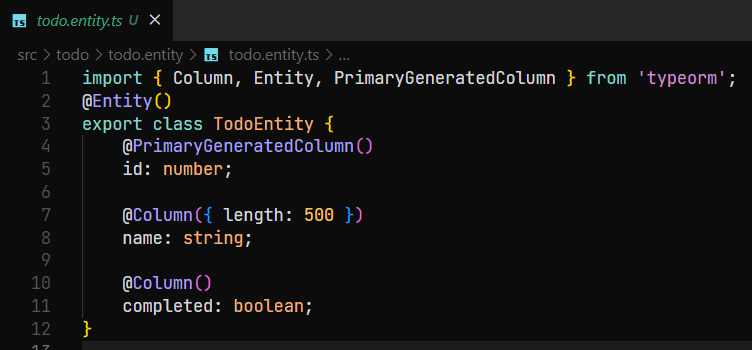

**Viết API theo hướng TDD trong nestjs**

Tạo một project nestjs trắng (sử dụng nest new “PROJECT\_NAME”) và hai
file test

**Giới thiệu nhanh về các test cases của hai files:**

**module.check.spec.ts**

Test liệu những modules đã được implement hay chưa

**todo.tests.spec.ts**

Import những modules, nhưng vì chúng chưa tồn tại, ta thêm //@ts-ignore
thế tắt check của typescript đi

Ta sử dụng beforeAll và TestingModule để xây dựng lên enviroment cho
test chạy

Ở đây ta chỉ định database là sqlite3 memory để thực hiện test và tách
biệt nó ra khỏi database chính

Ngoài ra có providers với getRepositoryToken function để lấy parameter
Repository đầu vào thay cho **@InjectRepository**

Viết test trước cho các tính năng sắp sửa implement

Cấu trúc API trong nestjs gồm 4 thành phần

**\*.module.ts** =&gt; định nghĩa những modules, controllers và
providers (services) sẽ được sử dụng

**\*.controller.ts =&gt;** dùng để kiểm soát cách người dùng tương tác
với server/api sử dụng route và thông qua 5 phương thức chính (get,
post, put, delete, update)

**\*.service.ts =&gt;** chứa những async function thực hiện nhiệm vụ ,
được gọi từ controller và 5 phương thức ở trên (ta có thể gộp chung code
vào với controller)

**\*entity.ts** : classes để tạo ra các objects hướng đối tượng , làm
việc với typeORM cũng như là schema của database

Ta sẽ gộp chung service vào controller cho dễ thao tác

Chạy npm test để chạy các files test , các file test có dạng
**\*.spec.ts**

Ta bắt đầu với file

**module.check.spec.ts =&gt;** Kiểm tra xem các modules có tồn tại hay
chưa, vì project mới tạo nên chắc chắn test case này sẽ failed

Ta implement modules còn thiếu bằng 3 lệnh sau

nest g module todo

nest g controller todo

nest g class todo/todo.entity

Xóa hết các file tests(\*.spec.ts) mẫu đi vì chúng ta không cần đến
chúng

Chạy lại tests

Test báo thiếu thư viện typeorm, chúng ta cài thư viện bằng lệnh

npm install --save @nestjs/typeorm typeorm mysql

Vì thư viện chưa tồn tại nên ta thêm comment //@ts-ignore để typescript
không báo lỗi trước runtime

Chạy lại test

Giờ test báo thiếu thư viện sqlite3 , vì trong test ta chỉ định test sẽ
sử dụng sqlite3 làm database phụ để thực hiện testing, đảm bảo không
dính dáng gì vào database chính

Chạy npm install better-sqlite3 –save

Chạy lại test

Cả 3 unit test đều trả về 404 , vì ta chưa code gì cho controller cả

Ta tiến hành code controller

src\todo\todo.controller.ts

Ta code tính năng/routes cho 3 test bị failed ở trên, ta cũng Inject
Reposititory để giao tiếp với database thông qua Entity

Chạy lại test

Vì ta muốn sử dụng TypeOrmModule và Entity , ta phải import dependency
của nó vào trong project , cụ thể là file todo.module.ts

Chạy lại test

Giờ web server bị lỗi 500 Internal Server Error

Server bị lỗi bởi vì ta chưa code schema cho Entity, vì thế nên typeorm
không biết get hay post data theo cách nào , dẫn đến lỗi

Ta code schema tại todo.entity.ts

Chạy lại test

